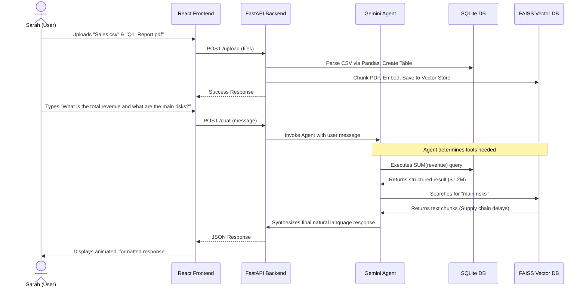

# DataPilot System Architecture & Workflow Documentation

This document provides an in-depth explanation of the DataPilot system. It answers why we chose specific technologies, how the system functions under the hood, and provides a detailed walkthrough of the user workflow.

## 1. The Core Problem

Knowledge workers and data analysts facing huge amounts of information experience massive friction. They have to:

- Write complex SQL queries or advanced Excel formulas to extract insights from structured data (CSVs, Spreadsheets).
- Manually read and use "Ctrl+F" to hunt for specific clauses and context inside massive unstructured documents (100-page PDF financial reports).
- Constantly switch between different tools (database clients, PDF viewers, BI dashboards) depending on the type of data they are analyzing.

DataPilot solves this by acting as a unified, natural language analytical engine. It seamlessly handles both structured and unstructured data through a Hybrid Retrieval-Augmented Generation (RAG) architecture.

## 2. System Architecture: How It Works & Why

Our system is divided into Three Major Pillars.

### Pillar 1: Data Ingestion & Processing Engine (The Backend Pipeline)
Instead of forcing users to pre-process their data, the system automatically structures it upon upload.

**How it works:**
- **Routing:** When a file is uploaded to the FastAPI backend, the system identifies its type.
- **Structured Data Pipeline (SQLite + Pandas):** If it's a CSV, Excel, or JSON, Pandas reads the file, sanitizes the column names, and dynamically creates a new table in a local SQLite database (`datapilot.db`).
- **Unstructured Data Pipeline (FAISS + Langchain):** If it's a PDF or TXT, Langchain's loaders extract the raw text. A `RecursiveCharacterTextSplitter` chunks the text into digestible pieces. These chunks are embedded using Google Gemini Embeddings and stored in a local FAISS vector database.

**Why we did it this way:**
- **Dual Database Approach over Pure Vector DB:** While Vector Databases (like FAISS) are incredible for semantic similarity, they are terrible at exact math, aggregations, and filtering (e.g., "Sum the revenue where region = North"). By using SQLite for tables and FAISS for text, we get the best of both worlds.
- **Pandas for ETL:** Pandas is exceptionally fast at reading various tabular formats and handles missing data gracefully before pushing it to SQL.

### Pillar 2: The Hybrid AI Routing Engine (The Logic Layer)
When a user asks a question, they don't have to specify which file they are asking about. They just use natural language.

**How it works:**
- **Tool-Calling Agent:** We use Langchain to create an AI Agent powered by Google Gemini (1.5 Flash). 
- **Dynamic Tool Selection:** The agent is equipped with two specific tools: a `sql_query_tool` (which can execute SQL against SQLite) and a `knowledge_retrieval_tool` (which queries FAISS).
- **Execution:** When the user asks "What were Q1 sales?", the LLM realizes it needs exact numbers and writes a SQL query. If they ask "Summarize the risk factors in the report", it executes a semantic search against the vector store.

**Why we did it this way:**
- **LLM-Driven Routing over Brittle If/Else logic:** Instead of writing complex Regex or classification models to route the user's query, we give the LLM the tools and let it reason about the best approach.
- **Gemini 1.5 Flash:** It provides a massive context window and rapid response times, making the conversational experience feel instantaneous and reliable.

### Pillar 3: The Aesthetic User Interface (The Frontend)
A premium analytical tool must feel fast, intuitive, and beautiful.

**How it works:**
- **React + Vite:** We use React for a component-based chat architecture and Vite for lightning-fast build times.
- **Design System:** We implemented a modern, sleek dark-themed interface using Tailwind CSS and Lucide React icons, focusing on minimalism to let the data shine.
- **Micro-Interactions:** We utilize Framer Motion to animate message bubbles and loading states, providing satisfying visual feedback.

**Why we did it this way:**
- **Tailwind CSS:** Allows us to rapidly prototype and enforce strict design constraints, ensuring consistent spacing, colors, and typography across the entire application without leaving the JSX files.
- **Framer Motion:** Static chat interfaces feel dead. Adding subtle entry animations makes the AI feel like a responsive, living assistant.

## 3. Detailed User Workflow

Let's walk through the exact journey of a user, "Sarah," an analyst from the moment she opens DataPilot.

### Step 1: The Ingestion Phase
- **Uploading:** Sarah drags and drops both her `SalesData.csv` and `AnnualReport.pdf` into the sidebar.
- **The Magic:** Behind the scenes, the FastAPI server routes the CSV to the SQL database and the PDF to the FAISS vector store. The UI shows a subtle loading spinner, followed by the files appearing in her "Sources" list.

### Step 2: The Query Phase
- **Asking Questions:** Instead of writing SQL, she simply types: "Calculate the total profit for the enterprise tier and summarize the security concerns mentioned in the report."
- **Reasoning:** Within milliseconds, the Langchain Agent intercepts the query. It realizes it has a multi-part question. It uses the `sql_query_tool` to calculate the profit, and simultaneously uses the `knowledge_retrieval_tool` to pull security context from the PDF.

### Step 3: The Insight Phase
- **Displaying Results:** The frontend receives a synthesized, highly accurate response. Framer Motion smoothly animates the text onto the screen. Sarah gets both the exact financial numbers and the nuanced risk summary in one cohesive message, without ever opening Excel or a PDF viewer.

## 4. Why This Architecture Wins (The "AI Engineer" Perspective)

By building the system this way, we prove we aren't just building a standard chatbot. We are building an Intelligent Analytical System:

- **True Hybrid RAG:** We solve the biggest flaw of standard RAG architectures (which fail spectacularly at mathematical aggregations and counting) by integrating deterministic SQL tools alongside probabilistic semantic search.
- **Extensible:** Because we use an Agent-based architecture, adding a new data source (like a live Postgres database, Notion, or an API) is as simple as defining a new `@tool` in Python. The LLM will automatically learn how to use it.
- **Delightful:** We shifted the immense cognitive load from the user (writing formulas, reading manuals, filtering rows) to the machine (AI intent parsing and tool execution), creating a frictionless, premium analytical experience.
